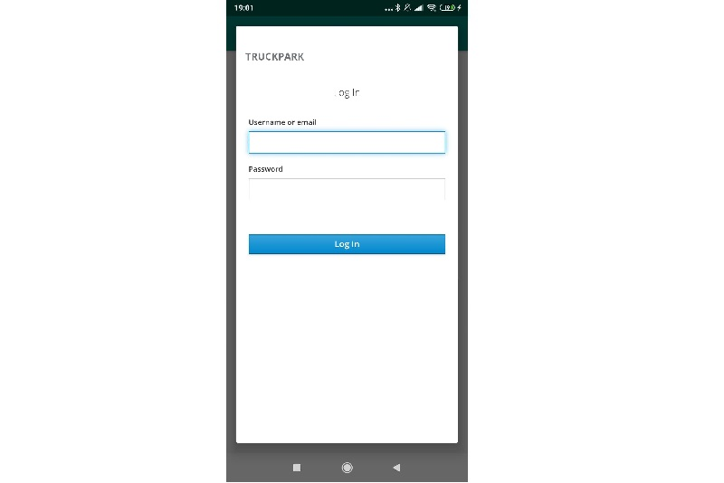
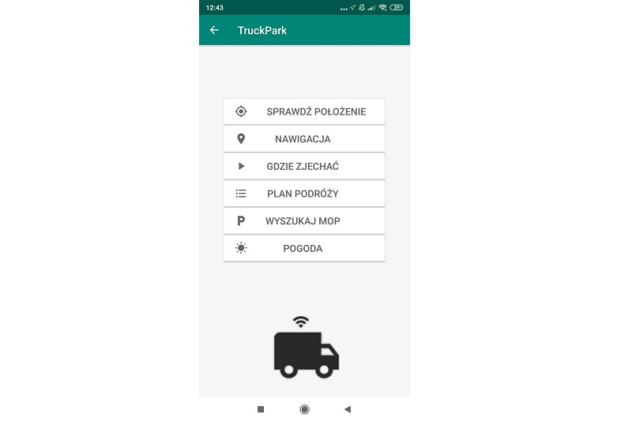

# TruckPark - mobile side
> The application has been designed and created as a complex solution for truck drivers and truck fleet companies to optimize the time of work and control trucks fleet. Both companies' management and truck divers could take huge benefits by using it due to economizing time and money. The system consists of two components. This Github repository concerns a mobile component.

## Table of contents
* [General info](#general-info)
* [Features](#features)
* [Technologies](#technologies)
* [External Services](#external-Services)
* [Status](#status)
* [Inspiration](#inspiration)
* [Contact](#contact)

## General info
> The main features of this mobile application are features helping truck drivers during his workday and send a truck's position to an application server. The driver has access to check his position, preview state of mops, and optimization module which is the most important feature in the app.

## Features
### User authentication
> User authentication is the first view after opening an application. This security view was implemented due to provide access to the application only for already-registered users. Logging view consists of two inputs: login and password. Currently, authentication data is mocked but eventually, the application will use the OAuth 2.0 protocol. After logging in, the user's position and state are sent to the server application and saved in a database.

### Main menu
> Main menu has been created as simple. GUI consists of app logo and buttons: 
* Location
* Navigation
* Route schedule
* Where to pull off
* Find MOP
* Check weather
which let a user choose a specific functionality.

### Location service
> It is a basic feature, which let the user preview his/her current position (update interval- every 5 second). The position is visualized as a blue circle on a base topographical map provided by GoogleMap. User's interaction with this functionality is limited to zoom in, zoom out and move on the map. During driving time camera view is moved with changing position so the location point is always centered.

### Navigation
> A feature that lets the user foud the most optimal route between any two locations. After typing values into inputs "origin" and "destination" and confirmation of a choice, a route between preferred points become shown on a map in the next view. The result is accomplished due to using of GoogleMaps RestApi service which the best polyline between two points has been calculated by distance, velocity, and traffic on roads.

     
### Route schedule
> Under Deployment.

### Optiomalize driver's time
> Under Deployment.

### Find MOP
> Find mop feature has been created as an access point to real-time MOP (Resting place for drivers) data. After MOP selection and confirm the choice, the user has access to current MOP's data. The data are updated in near real-time. On new views the user has access to some categories and information:
* Main mop data
	* Organization
	* Place
	* Identification data
	* Category
	* Coordinates	
* Road information
	* Road class
	* Road number
	* Direction
* Quantity of parking places
	* Quantity of truck places (all)
	* Quantity of free truck places
	* Quantity of passenger places 
	* Quantity of coach places 
* Facilities and safety (yes/no)
	* Security
	* Fence
	* Security video
	* Petroleum
	* Restaurant
	* Place to stay
	* Toilet
	* Carwash
	* Workshop
	* Lighting
	* ElectricCharger
	* DangerousCargo
* Information about MOP's owner
	* Organization
	* Phone number
	* E-mail adress
> The MOP data are collected from Rest Api Service established on server application (part of the system).

### Check weather
> Additional functionality allowed checking current weather conditions in the indicated location. Data are collected from external web services. Available weather information is: 
* Temperature(°C)
* Atmospheric phenomena
* Visibility (km)
* Pressure (HPa)
* Wind speed (m/s)
* Cloud cover (%)

## Technologies
* Java SE 8
* Android SDK 26
* FasterXML/Jackson 2.9.10
* REST API
* Maps SDK for Android 2
* JUnit 4.12
* Hamcrest 1.3

## External Services	
* GoogleMaps Map Service 
* GoogleMaps Directions Rest Api
* OpenWeatherMap Rest Api

## Status
Project is: _in_progress_.

## Inspiration
The project has been being created as a continuation of the author's master thesis - "Developing time optimization system for truck drivers" completed in 2018. Theoretical conceptions proposed in the document have been being implemented in this software. The main goal of this project is putting theory into practice.

## Contact
Creating by [@Marek Sitarski](https://pl.linkedin.com/in/marek-sitarski) - marek_sitarski@vp.pl. 

